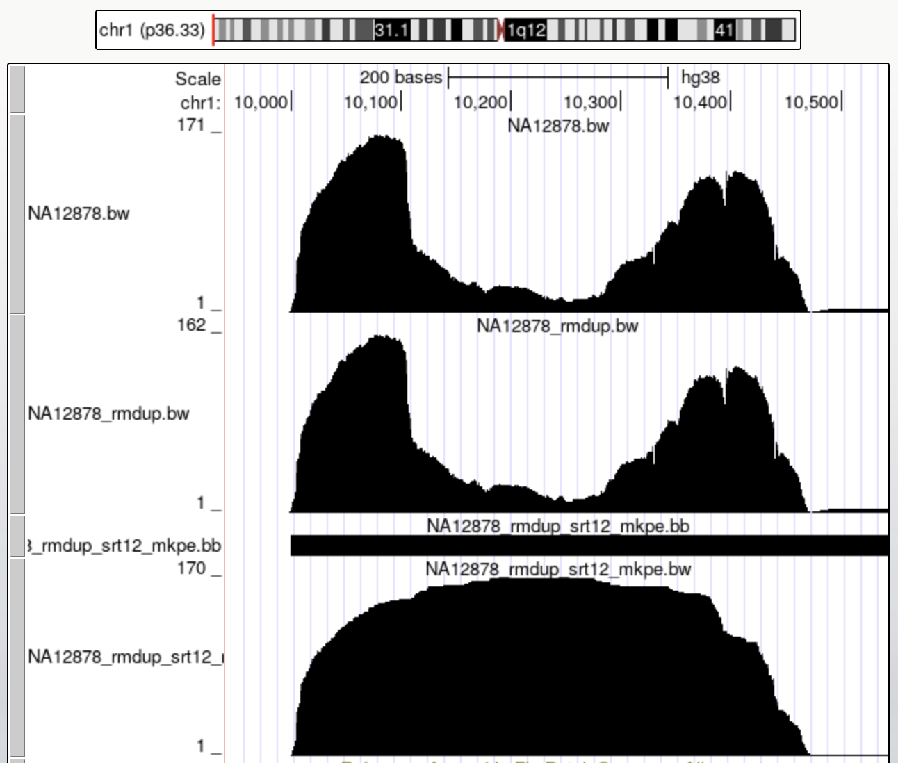

## Preprocessing:

* The NA12878 BAM file links to a CRAM file that is difficult to open using standard Samtools. So my first step is to find a version that works with the cram file (samtools 1.20 with htslib 1.20 on Mac) to convert the cram file to BAM file.
* In the assignment description, the WGS data is probably aligned to "GIAB" reference genome(?) and requested the alignment to GRCH38 reference genome. We decided to re-map to GRCH38 reference genome, this step could be unneccessary, but it is helpful to correct display the results on UCSC genome browser.
* The CRAM is mapped to ftp://ftp.1000genomes.ebi.ac.uk/vol1/ftp/technical/reference/GRCh38_reference_genome/GRCh38_full_analysis_set_plus_decoy_hla.fa based header information of [NA12878.alt_bwamem_GRCh38DH.20150718.CEU.low_coverage.H](src/NA12878.alt_bwamem_GRCh38DH.20150718.CEU.low_coverage.H)
* I downloaded the standard GRCH38 reference genome from https://s3.amazonaws.com/igenomes.illumina.com/Homo_sapiens/NCBI/GRCh38/Homo_sapiens_NCBI_GRCh38.tar.gz
* I searched the website and found the fastQ files in the same directory of CRAM file.
* After I downloaded the fastQ files, I noticed the sequencing qualities were abnormal (many repeated '?').
* Instead, I extracted the fastQ files from the CRAM files instead. I checked that the fastQ files are complete, they are pair-ended.
* Next, I mapped the fastQ file to NCBI GRCH38 reference genome using BWA (mem), generated BAM and BW files.
* I used Picard to remove the duplicates and generated BAM and BW files.
* The sequencing data is pair-ended, the segments of the middle of R1 & R2 reads should be considered as covered regions. Then I generated segment files in bed format by merging R1 and R2 regions. Single mapped and distance of pairs longer than 10K are trimmed. I noticed most of the regions have strand of +(R1, left) and -(R2, right), shouldn't 50% +(R1, left) with -(R2, right) and 50% +(R2, left) with -(R1, right)?
* The segment files are converted into bed, BB, and BW formats.

## Data analysis:

* A simple way to calculate the number of reads in a given region is to use "samtools view <BAM> <region>" or "bedtools intersect -a <BAM> -b <region>" and then count the lines of the outputs. 
* Example: assuming the region of interest is **chr1:10300-10310**. There are **49** reads

```
samtools view NA12878_rmdup.bam chr1:10300-10310 | wc -l
     49
samtools view NA12878_rmdup.bam chr1:10300-10310 | head -n 3
SRR622461.24754274	97	chr1	10203	2	39M1I61M	chr5	11673	0	CTAACCCTAACCCTAACCCTAACCCTAAACCCTAACCCTAAACCCTAAACCCTAAACCCTAACCCTAACCCTAACCCTAACCCTAACCCTAACACTAACCC	<B<<<BBBBBBBBBBBBBBBBBBBBBBB<B<<BB<BB<B<'''''''''''''''''''''''''''''''''''''''''''''''''''''''''''''	MD:Z:28C59C3C1C5	PG:Z:MarkDuplicates	RG:Z:RG1	NM:i:5	AS:i:76	XS:i:72
SRR622461.76965739	113	chr1	10241	24	51M1I38M1D11M	chr21	46699842	0	AAACCCTAAACCCTAAACCCTAACCCTAACCCTAACCCTAACCCTAACCCCTAACCCTAACCCCAACCCCAACCCCAACCCCAACCCTAACCCTAACCCTA	7<<<<B<0BB<<<0<<7<B<<B<BBBB<<<B<<<<<BB<<<BBB<B<BBBBBBBBBB<BBBBBBBBBBBBBBBBBBBBBBBBBBBBBBBBBBBBBBB<B<<	XA:Z:chr19,+58607453,2S70M1D21M8S,4;chr12,-10423,39M1I7M1I53M,6;chr1,+248946159,50M1I35M15S,4;chr1,-180904,54M1D40M7S,6;	MD:Z:0T55C32^C11	PG:Z:MarkDuplicates	RG:Z:RG1	NM:i:4	AS:i:80	XS:i:69
SRR622461.66	147	chr1	10256	48	10S26M1I34M1I29M	=	10016	-329	CCCCACCCCCAACCCTAACCCTAACCCTAACCCTAACCCCTAACCCCAACCCCAACCCCAACCCCAACCCCTAACCCTAACCCTAACCCCTAACCCTAACC	''''''''''''''''''''''''''''''''''''''''''''''<<7<BBB<7BBBBBBBBB<B<BBBB<BBBBB<<BBBBBBBBBBBBBBBBB<<B<<	XA:Z:chr1,+248946137,29M1I32M5D29M10S,8;chr1,-10364,10S37M1D20M1I33M,5;	MD:Z:65C23	PG:Z:MarkDuplicates	RG:Z:RG1	NM:i:3	AS:i:70	XS:i:62
```
* Calculate over the segments, there are **162** overlapped fragments (speed up, region of interest is included in the first 1000 lines of NA12878_rmdup_srt12_mkpe.bed):

``` 
bedtools intersect -a <(head -1000 NA12878_rmdup_srt12_mkpe.bed) -b chr1.bed -wa|head
chr1	10000	10350	350	+
chr1	10000	10382	382	+
chr1	10000	10391	391	+
chr1	10000	10396	396	+
chr1	10000	10447	447	+
chr1	10001	10390	389	+
chr1	10001	10426	425	+
chr1	10002	10382	380	+
chr1	10002	10398	396	+
chr1	10002	10418	416	+
[bli@silencer fg]$ bedtools intersect -a <(head -1000 NA12878_rmdup_srt12_mkpe.bed) -b chr1.bed -wa|wc
    162     810    3726
```
* Ploted region of interest (pair-end segments reflect better coverage than R1/R2 reads):


* To calculate the depth of the coverage, we can also use samtools or bedtools coverage depending on the stringency, note that the depth may not reflect the number of reads, for example, for a region of two bp, depth could be all 1, but each bp could come from different reads. 
* For a series of regions, samtools or bedtools coverage calculate the coverage efficiently. Note that if the regions overlap or are too close, reads can be counted multiple times. And, when only a portion of the reads overlap, should it be counted as one or partial?
* For the pair-ended reads, counting segments that include R1 and R2 is a good practice since they have biological meaning. Meanwhile, part of the reads, too long or single-mapped reads will be dropped.
* Quality should also be considered in the data processing. When the qualities of the reads are too low, we should drop the mapping (Q30?, not implemented yet)
* Reads mapped to alternate locus (Not implemented yet)
* Current results on UCSC genome browser:
**[https://genome.ucsc.edu/s/Susan123/fulgent](https://genome.ucsc.edu/s/Susan123/fulgent)**
* **Rmdup** removed 40% of duplicates & biases of mapped regions:

* **Fragment** of pair-ended reads reflects better coverage, where **rmdup** made less impacts:

* The WGS coverage should include both reads(R1/R2) and the fragment overlap. We need to merge and remove the duplicates for the WGS coverage (not implemented yet)
 
## Post-processing:

* I drafted a data processing script in Python [coverage_dev.py](src/coverage_dev.py). In this python file, I utilized pysam's functions to calucate depth for each basepair, I also calculate the mean, median, standard deviation for each regions in the bed file. The quatiles for all of the regions in the bed file are also calculated. To difine the regions with high and low regions, I defined them using the 30 and 70th quatiles. The results from this study is available in the [example](example/) folder.The program also provided reads distribution in the bed file. shown as below, this study is based on the bed file generated using [random.pl](src/random.pl). 

* example:
```
./random.pl > random.bed
python coverage_dev.py --bam NA12878_rmdup.bam --bed random.bed --output random --reference genome.fa
```

* outputs (top 3 lines):

```
==> example/gc_bias.csv <==
,gc_content,mean_coverage
0,0.4875,4.9391
1,0.5257,4.2162

==> example/global_stats.csv <==
,mean_coverage,median_coverage,std_coverage
0,4.9771412882787756,5.0,2.3473035118324352

==> example/percentiles.csv <==
,p10,p25,p50,p75,p90
0,2.0,3.0,5.0,7.0,8.0

==> example/random.bed <==
chr1    860368  870368
chr1    4510135 4520135
chr1    8312956 8322956

==> example/regions.csv <==
,chrom,start,end,mean_coverage,median_coverage,std_coverage
0,chr1,860368,870368,4.9391,5.0,2.428660369421793
1,chr1,4510135,4520135,4.2162,4.0,2.2004221322282684

==> example/regions_high.csv <==
,chrom,start,end,mean_coverage,median_coverage,std_coverage
28,chr1,85434652,85444652,6.234,6.0,2.4378769452127806
92,chr2,32529632,32539632,6.1144,6.0,2.3733336554306894

==> example/regions_low.csv <==
,chrom,start,end,mean_coverage,median_coverage,std_coverage
2,chr1,8312956,8322956,3.715,3.0,2.3888438626247637
37,chr1,113064858,113074858,3.9336,4.0,2.841512104496477
```


### Scripts:

* Sort fastq/bam file:
```
zcat sample.fastq.gz | paste - - - - | LC_ALL=C sort -S 30% --parallel=8 | sed 's/\t/\n/g' | gzip > sorted.fastq.gz
samtoos view sample.bam | paste - - - - | LC_ALL=C sort -S 30% --parallel=8 | sed 's/\t/\n/g' | samtools view -Sb - > sorted.bam
```

* Mapping:

```
bwa mem -t 8 genome.fa R1.fastq.gz R2.fastq.gz | samtools view - -Sb | samtools sort - > sorted.bam
```

* Rmdup (picard needs replacerg):

```
samtools addreplacerg -r "@RG\tID:RG1\tSM:NA12878\tPL:Illumina\tLB:NA12878.fa" -o $ID.sam $ID.bam
java -jar picard.jar MarkDuplicates     I=$ID.sam     O=$ID.bam     M=${ID}_dup_metrics.txt     REMOVE_DUPLICATES=true
```

* bw.sh:

```
ID=NA12878_rmdup
bedtools genomecov -ibam $ID.bam -bg > $ID.bedgraph
LC_ALL=C sort -S 30% --parallel=8 -k1,1 -k2,2n $ID.bedgraph > ${ID}_srt.bedgraph
bedGraphToBigWig ${ID}_srt.bedgraph chrom.sizes ${ID}_srt.bw
```

* mkpe.sh

```
bedtools bamtobed -bedpe -i $ID.bam > $ID.bedpe
./mkpe.pl $ID.bedpe | LC_ALL=C sort -S 30% -k1,1 -k2,2n --parallel=8 > ${ID}_mkpe.bed
bedtools genomecov -i ${ID}_mkpe.bed -bg -g chrom.sizes > ${ID}_mkpe.bedgraph
LC_ALL=C sort -S 30% --parallel=8 -k1,1 -k2,2n ${ID}_mkpe.bedgraph > ${ID}_srt.bedgraph
bedGraphToBigWig ${ID}_srt.bedgraph chrom.sizes ${ID}_mkpe.bw
```

* bb.sh

```
awk '{print $1"\t"$2"\t"$3}' input.bed | LC_ALL=C sort -S 30% --parallel=8 -k1,1 -k2,2n > tmp.bed
bedToBigBed tmp.bed chrom.sizes output.bb
```

* mkpe.pl 

```
#!/usr/bin/perl
while (<>) {
		($chr1, $s1, $e2, $chr2, $s2, $e2, $rid, $score, $fr1, $fr2)=split();
		next unless $chr1 eq $chr2;
		next unless $chr1 =~ /chr/;
		next unless $fr1 ne $fr2;
		$dist=$e2-$s1;
		next if $dist<1;
		next if $dist>10000;
		print "$chr1\t$s1\t$e2\t$dist\t+\n" if $fr1=~/\+/;
		print "$chr1\t$s1\t$e2\t$dist\t-\n" if $fr2=~/\+/;
}
```
